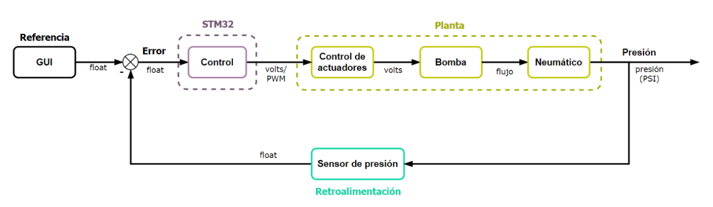
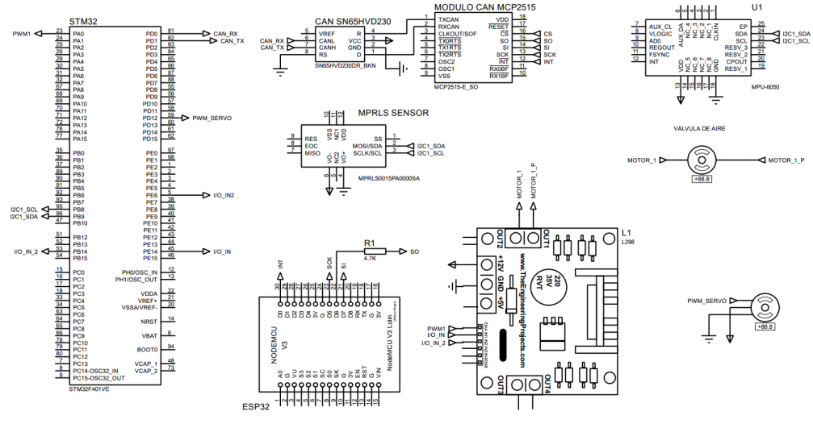
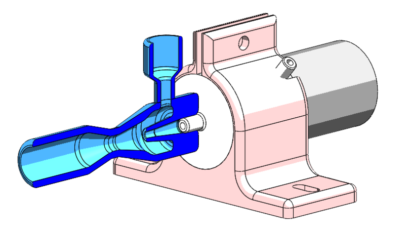
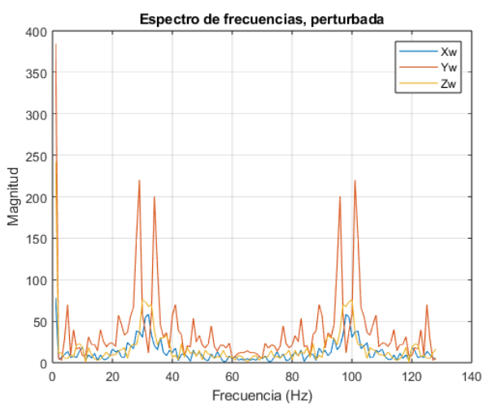
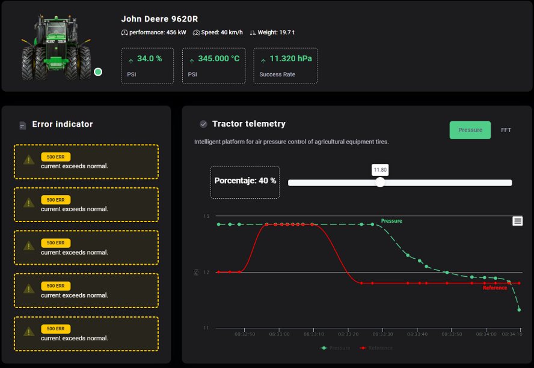

## Embedded systems and control engineering project selection

---
### Smart framework for air pressure control in agricultural vehicles
Implementation of advanced embedded systems and control engineering
[In collaboration with John Deere](https://www.deere.com/en/index.html)

Design and development of a system capable of measuring the tire pressure and adjusting it to a desired value given by the user from a graphical interface in order to adapt the John Deere vehicles to the terrain conditions it has to traverse, and thus maximize its service life. 

This is achieved through the implementation of a closed-loop PID control system in real time (RTOS) inside a STM32 microcontroller that receives through the CAN protocol the information from the reference and sends the corresponding signal to activate the pump or valve to make the pressure adjustment. The second core of the microcontroller performs a Fourier analysis of the pump vibrations to compensate for measurement errors due to noise.

The system is also capable of sending the information to a remote server through the MQTT protocol with an ESP32, so that the user can monitor the pressure of the tires in real time.

</img> </img> </img> </img> </img>

---
### Gas detection safety system
[Supervised by Intel](https://www.deere.com/en/index.html)

To implement a safety system that focuses on the detection of harmful gases, interconnected sensors that measure different environmental variables are needed. If the concentration of harmful gases is above the permitted limits measured with an MQ3-alcohol and MQ135-CO2 sensors, the system activates ventilation fans and alarm systems to prevent accidents and preserve the health and well-being of individuals. The microcontroller used is an ATmega328P, which additionally communicates via Bluetooth with a computer to monitor the system in real time.

---
### Smart garbage bin system
Implmentation of the internet of things

This smart trash monitoring system uses a Raspberry Pi an ultrasonic sensor to determine the percentage of waste accumulated in the bin. The data is sent and stored in a MySQL database deployed with XAMPP, and presented on a dashboard for easy and convenient viewing by users. The idea is, if expanded, to have a network of cans to improve the route efficiency of garbage collection services. 

Two types of MQTT protocol inputs were used in Node-Red to receive measurements from the simulation and the physical sensor. Each input went into a separate function to provide the necessary formatting and perform the evaluation of the requirements. The information was filtered and sent via email and Telegram notifications.

---

